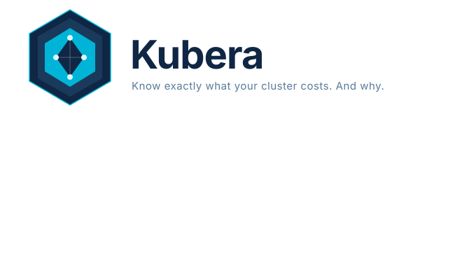

<p align="center">
  
</p>

# Kubera

**Know exactly what your cluster costs. And why.**

Kubera runs inside your cluster, watches every workload's resource requests vs actual usage, and generates a plain-English efficiency report when you click **Analyze** — powered by Gemini AI.


## What it does

- Polls the Kubernetes API + Metrics Server every 5 minutes
- Computes CPU and memory waste ratios per workload, ranked by biggest offender
- Streams an AI-generated efficiency narrative (percentages, not fake dollar estimates)
- Suggests exact `kubectl patch` commands to right-size each workload

## Install

### Prerequisites

- Kubernetes cluster (any — EKS, GKE, AKE, k3s, minikube all work)
- [Helm 3](https://helm.sh/docs/intro/install/)
- A [Google Gemini API key](https://aistudio.google.com/app/apikey) (free tier works)
- Metrics Server installed in the cluster (optional — Kubera works without it, just less precise)

### One-liner install

```bash
helm repo add kubera https://abhishekgit03.github.io/Kubera
helm repo update

helm install kubera kubera/kubera \
  --namespace kubera \
  --create-namespace \
  --set gemini.apiKey="YOUR_GEMINI_API_KEY"
```

### Access the dashboard

```bash
kubectl port-forward svc/kubera 8080:8080 -n kubera
```

Open [http://localhost:8080](http://localhost:8080).

### Expose via Ingress (optional)

```bash
helm install kubera kubera/kubera \
  --namespace kubera --create-namespace \
  --set gemini.apiKey="YOUR_KEY" \
  --set ingress.enabled=true \
  --set ingress.host="kubera.yourdomain.com"
```

## Configuration

| Parameter | Default | Description |
|---|---|---|
| `gemini.apiKey` | `""` | Google Gemini API key (required) |
| `gemini.model` | `gemini-2.5-flash` | Gemini model to use |
| `gemini.existingSecret` | `""` | Use an existing k8s Secret instead of `apiKey` |
| `collector.refreshIntervalSeconds` | `300` | How often to poll the k8s API |
| `pricing.cpuCostPerCoreHour` | `0.048` | Used for relative waste ranking only |
| `pricing.memCostPerGBHour` | `0.006` | Used for relative waste ranking only |
| `service.type` | `ClusterIP` | Service type (`ClusterIP`, `NodePort`, `LoadBalancer`) |
| `ingress.enabled` | `false` | Enable Ingress |
| `ingress.host` | `kubera.internal` | Ingress hostname |

> **Note on pricing rates:** These values are used only for ranking workloads by waste — they are not billing-accurate. Any consistent values will produce correct relative rankings. The AI narrative speaks in percentages, not dollar amounts.

### Use an existing secret for the API key

```bash
kubectl create secret generic kubera-gemini \
  --from-literal=GEMINI_API_KEY=your-key \
  -n kubera

helm install kubera kubera/kubera \
  --namespace kubera --create-namespace \
  --set gemini.existingSecret="kubera-gemini"
```

## Upgrade

```bash
helm repo update
helm upgrade kubera kubera/kubera -n kubera
```

## Uninstall

```bash
helm uninstall kubera -n kubera
kubectl delete namespace kubera
```

## How it works

1. Kubera runs as a single pod with a read-only ClusterRole — it never writes to the cluster
2. Every N minutes it lists all Deployments, StatefulSets, and DaemonSets and their pod metrics
3. It computes CPU/memory utilization ratios and ranks workloads by waste
4. When you click **Analyze**, it builds a structured JSON payload and streams it through Gemini
5. The narrative names specific workloads and tells you exactly what to change

## Local development

```bash
# Clone
git clone https://github.com/abhishekgit03/Kubera
cd Kubera

# Run backend with mock data (no cluster needed)
GEMINI_API_KEY=your-key make dev-backend

# In a second terminal: run the frontend dev server
make dev-frontend
# Open http://localhost:5173
```

## Contributing

PRs welcome. Open an issue first for anything larger than a bug fix.

## License

MIT
